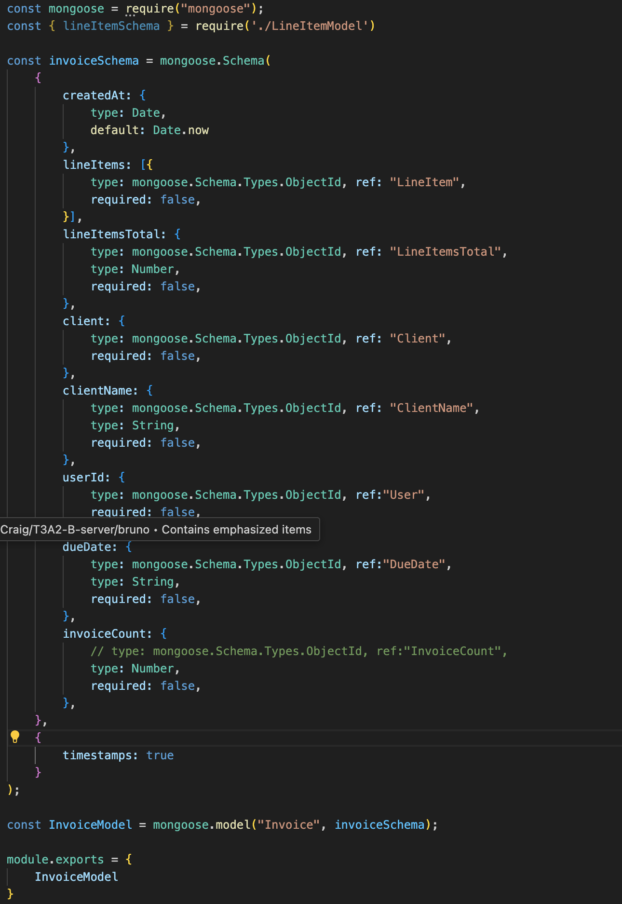
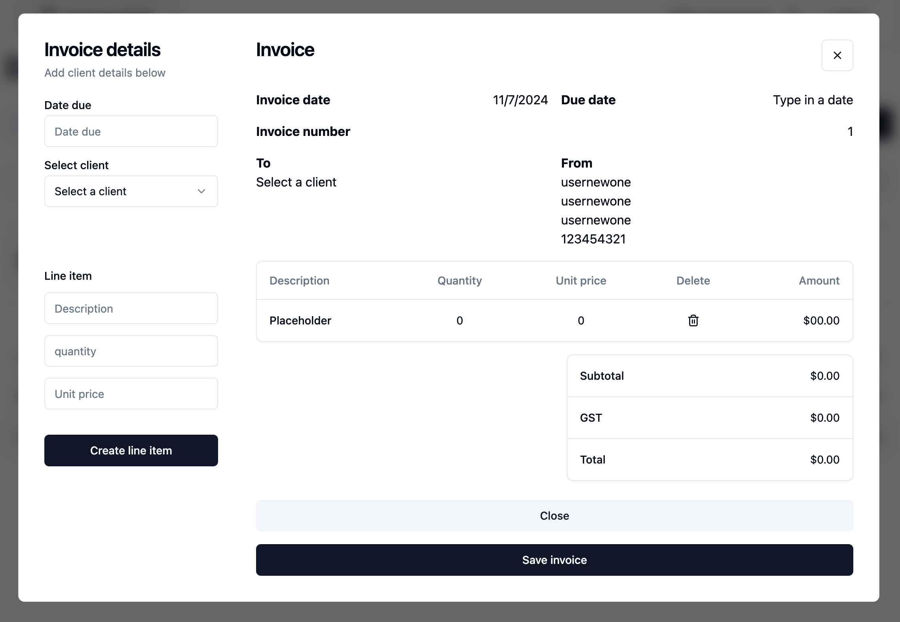

# Introduction

This is the write up for Sup Invoice - an invoicing app designed for freelance creatives. It's simple and helps them get the job done and pay their bills.

We've tested this app with two users:
* one: a designer 
* two: a video editor

The app is named 'Sup Invoice' as its a domain name that was short, cheap and a memorable word. People use the word sup to say hello, which is friendly and its short for super.

---

# R1	

#### At a minimum use the following technologies: MongoDB, Express, React & Node
---
Front-end technologies. Mainly React, with Tailwind & ShadCN component libraries.

Back-end technologies. Mainly MongoDB (with Mongoose), Express and Node (paired with Nodemon) to run everything.

The rest can be seen in package.json files.

# R2	

#### Write well designed code that:
1. Separates the program into modules that each deal with one particular focus, or concern
2. Demonstrates DRY (Don’t Repeat Yourself) coding principles

    On the front-end my src folder houses all of the assets, compoents, context and lib files. Each file has its own focus and concern, allowing them to be easily applied and reused.

    

    **Example one**

    * The header has a mode toggle which toggles dark and light mode - this means its only written once, which is super DRY. The theme is built into context, which provides it to the whole site. This allows for extremely swift and worry free developing. This makes updating my shadCN components a breeze.

    **Example two**

    * The loading spinner is used throughout the site for loading components. Its one component which is in one file, but its called upon in many ways.

    **Example three**

    * UserContext supplies the cookies to authorise acess throughout the site.
    

    On the back-end the folders are organised into tests, bruno(API client) controllers, middleware, models and routes. Each file has its own focus and concern, allowing them to be easily applied and reused.

    

    **Example one**

    * Auth Middleware - on developing the backend, the auth checker for cookies, was copy and pasted many times. This lead to it being converted into middleware, meaning it was only written once and could be passed to any route. This made the code very DRY.

        

    **Example two**

    * For testing purposes - the server was modulized. This meant the database could be detached and a mock databse could provide tests the routes. It's also made it incredibly neat. 

    **Example thee**

    * The router files became very clean and try, this allowed making news ones to be extremely swift and easy.
    
        

### Uses appropriate libraries

---

#### Front-End Dependencies

-   @headlessui/react: ^2.1.2 - really great UI library
-   @heroicons/react: ^2.1.5 - I really great icon library
-   @radix-ui/react-dropdown-menu: ^2.1.1 - dropdown is a menu function used in the invoice creation
-   @radix-ui/react-label: ^2.1.0 - react labels are for making labels
-   @radix-ui/react-scroll-area: ^1.1.0 - this has been used in the drop down and on mobile with the invoice maker
-   @radix-ui/react-select: ^2.1.1 - this allows us to select elements like drop downs.
-   @radix-ui/react-slot: ^1.1.0 - slows allows us to pass elements to a component
-   @radix-ui/react-switch: ^1.1.0 - the switch has been used to toggle
-   @radix-ui/react-tabs: ^1.1.0 - react tabs has been used on the dashboard and on the login page
-   class-variance-authority: ^0.7.0 - this allows controll of the classes in CSS sheets
-   clsx: ^2.1.1
-   file-saver: ^2.0.5 - this was used to develop the screenshoting and file saving function
-   html2canvas: ^1.4.1 - this was used to develop the screenshoting and file saving function
-   lucide-react: ^0.418.0 - really great UI library
-   react: ^18.3.1 - the great front end javascript library
-   react-dom: ^18.3.1 - this allows us to change pages in the front end
-   react-router-dom: ^6.26.0 - this allows us to change pages in the front end
-   tailwind-merge: ^2.4.0 - this is the front end front end CSS replacement. It's great, I love it
-   tailwindcss-animate: ^1.0.7 - this is the front end front end CSS replacement. It's great, I love it. The animate was used for the buttons and loading animations

#### Front-End Dev Dependencies

-   tailwindcss: ^3.4.7 - this is the front end front end CSS replacement. It's great, I love it
-   vite: ^5.3.4 - this app was first started and run on vite

#### Back-End Dependencies

-   bcrypt: ^5.1.1 - this does all the auth/encryption for to auth our users
-   cookie-parser: ^1.4.6 - this allows us to pass the users from the backend to the browser and store it
-   cors: ^2.8.5 - checks where the request comes from and validates it
-   dotenv: ^16.4.5 - hides all of our secret info from github
-   express: ^4.19.2 - express is what the server is built and deployed on
-   jsonwebtoken: ^9.0.2 - JWT is what we used to log in and log out - it works with bcrypt to keep things very excure
-   mongodb: ^6.8.0 - the database in which all of our data is saved too.
-   mongoose: the package used to make modals to send the code to our mongoDB database

### Demonstrates good code flow control for user stories

---

The flow control of our users is fundamentally how this app works. The app allows our users to flow through the app based on the inputs they supply. Code is executed on their inputs and this achieves the users desired outcome.

**Login/register**

If a user has an account they can login. If a user wants an account they can register ad add their own personal user/business details.

**Invoice - view/download/create/delete**

If user has login or has registered they can create, download, view and delete invoices. This is all accessable by the home screen

**Users - view/create/delete**

If user has login or has registered they can add, view and edit their own details. This is all accessable by the home screen

**Clients - view/create/delete**

If user has login or has registered they can create, add to invoice and delete clients. This is all accessable by the home screen

STORY TESTS CONTROL FLOW [HERE](https://docs.google.com/spreadsheets/d/1_ZV2VED6lpS2cvqT7ImGNyekecFCfuunWcNHRNDakc0/edit?usp=sharing)

### Applies Object Oriented (OO) principles/patterns

---

Object Oriented (OO) principles have been heavily applied to mongoose schema structures. 

Object Oriented (OO) principles have been heavily applied to all controller routes.

### Uses appropriate data structures

---

**Functions**

Functions have been used throughout to create resuable code. Here are a couple of examples:

This auth middleware was created and reused thoughout the backend.

This header function was made once but used on every page on the app.

**Ranges**

Ranges have been used throughout to to handle data. Here are a couple of examples:

Reducers and filers were used throughout to find and complete math logic, here are some examples:

**Classes (useState/useEffect etc)**

Classes have been updated in recent years in react, therefore hooks which are a newer practice have been used throughout. The app is full of useState/useEffect.

useState and useEffect were used throughout the project to complete almost every useable function on the app, here are some examples:

---

# R3	

#### Employ and utilise proper source control methodology (git)
---
**Front-End**

At the time of writing this my front-end has 72 commits, with 6 completed feature branches. This was important for setting up new fetch routes, adding providers/context, refactoring the code to make it dryer and adding in line-items to invoices, which was was an oversight in the original plan.

**Back-End**

At the time of writing this my back-end has 69 commits, with 9 completed feature branches. The branches were extremely important for features like middleware, line items and fragmenting it into files. I had it working and on making these major updates I didn't want to be adding these experiments to main.

Backend:

* Middleware setup branches
* line item experimentation branches (this was important as I wasn't sure if it would work)
* Router controller development.

# R4	

#### **Demonstrate your ability to work in a team**:
* Use a recognised project management methodology
* Use a recognised task delegation methodology
---

We've used a Kanban framework to impliment agile development processes to complete this first working version of Sup Invoice.

Trello was utilized to impliment deligate tasks, plan the project and follow it through.

**July 18**

Init setup and auth setup

**July 19**

Create invoice modals and invoices - finish profile/login from Auth setup

**July 20**

Invoice routes setup

**July 21**

Client routes setup

**July 22**

Users routes setup

**July 23**

Restructure the file for DRY code

**July 24**

Create line items

**July 25-31**

Testing

**Aug 1**

Setup vite, headers and router

**Aug 2**

UX and component setup

**Aug 3**

UX and component setup with some logic setup

**Aug 4**

UX and component setup

**Aug 5**

Auth logic applied to UX

**Aug 6**

Invoice logic developed

**Aug 7**

Invoice logic developed

**Aug 8**

Invoice logic developed

**Aug 9**

Invoice logic developed, tidy up and delete functions 

**Aug 10**

More tidy up and deployment

# R5/ R6

#### Produce a working application that meets client and user needs
#### Deploy the application to a cloud hosting service
---

Deployed Sup Invoice can be found [HERE](https://supinvoice.com)

Netlify subdomain [HERE](sup-invoice.netlify.app)

API can be found [HERE](https://t3a2-b-server.onrender.com)

# R7	

#### Produce an application with an intuitive user interface
---

This web application has utilized the ShadCN UI library, as well as tailwind. This mean't that the site is high user friendly and sleakly designed. Which is perfect for our itended users - professional freelance designers. We were tasked with developing an invoicing app. Below are five examples of great intuitive user interface design.
        
**Utilizing tabs**

Tabs are great as they don't feel like you're changing page, as the UX doesn't reload. This means you can display a lot of info and make it extremely easy to access. We used tabs on the home page to display the different pages. Overview, which shows all of the invoices, clients which displays all of the clients and settings which is a form to update the registers users details.

**Modals** 

Modals are another great UX trick, it makes the user feel like they are still on the home page. Making the pages minimal makes it feel less complex. The fact the user can see the app behind it (blurred) means it doesn't feel hard to get back to the main interface. Modals were utilized twice for client creation, invoice creation and invoice viewing.

**Dark and light mode**

With more and more users getting large 4k screens with strong blue light - light mode is becoming less and less. This is due to it putting a lot of strain on the eyes due to its brightness. The ShadCN library made it really easy to impliment this.

**Dropdowns**

A user could have hundreds of clients. Thats why we've used dropdowns to display the clients. This means it will appear in a scrollable list, easy for the user to find them. 

**Register flow**

The registration flow consists of two screens, one the registration section, which takes an email and password. Then once its been completed, the cookies are stored - meaning the user can be logged straight in. A pop up is added which gets the users details and stores them. Once complete it redirects to the home page so users can start making some invoices!

# R8 / R9	

#### Provides evidence of user testing:
* In the development environment
* In the production environment

#### Utilises a formal testing framework

---

## User Story testing

MANUAL USER STORY TESTS - sheet [HERE](https://docs.google.com/spreadsheets/d/1_ZV2VED6lpS2cvqT7ImGNyekecFCfuunWcNHRNDakc0/edit?usp=sharing)

Primary - designer

1. As a freelance designer I want a simple web app for managing my invoicing needs, including clients, projects, and invoices. So that I have more design work time and administrative tasks take less time. 

    
    ✅ **Manual user test**
  
    

    ✅ **Solution**

    

    User interface is simple and easy to use. Everything that a user could want is on the home page, with easy access. This is exactly inline with our users needs

2. As a freelance designer, I want to make and send minimalistic invoices to my clients, so that I can speed up my billing and sleep easily.

    ✅ **Manual user test**
    
    

    
    ✅ **Solution**

    
    
    The invoice is all there and easy to access. It has a download button for easy and simplistic sharing.

3. As a freelance designer, I need to be able to see all of my invoices, so that I can follow up on payments and manage my clients effectively.

    
    ✅ **Manual user test**

    

    The dashboard has everything this designer needs. The date is the first thing, so users can look, see when they made it and make any follow ups or checks with their clients.

4. As a freelance designer, I need to be able to add or expense design assets, so that I can charge these expenses to my clients.

    ✅ **Manual user test**

    

    ✅ **Solution**

    
        
    A simple yet simplistic way to add new line items to the invoice. They are added on the left and users can see them on the right side. They automatically sum up and they're easy to delete.

Secondary - Video editor
1. As a freelance video editor, I want a simple web app for managing my invoicing needs, including clients, projects, and invoices. So that I can spend more time on video editing and less time on administrative tasks.

    
    ✅ **Manual user test**

    

    ✅ **Solution**

    

    User interface is simple and easy to use. Everything that a user could want is on the home page, with easy access. This is exactly inline with our users needs
        

2. As a Video Editor, I want to create invoices that include hour rates, day rates and project details, So that my clients clearly understand what they are paying for.

    ✅ **Manual user test**

    

    
    ✅ **Solution**

    
        
    A simple yet simplistic way to add new line items to the invoice. They are added on the left and users can see them on the right side. They automatically sum up and they're easy to delete.
        

3. As a Video Editor, I want mobile access to create and look after invoices when I am out and about, So that I can make my job flexible and responsive to client needs.

    
    ✅ **Manual user test**

    

    ✅ **Solution**

    

    

    
        

    The design is completely responsive and even works on devices with small screens - down to 300px in width. Which by todays standards - is small.

4. As a Video Editor, I need to be able to add or expense stock footage or hard drive processing, so that I can charge these expenses to my clients.

    
    ✅ **Manual user test**

    

    ✅ **Solution**

    
        
    A simple yet simplistic way to add new line items to the invoice. They are added on the left and users can see them on the right side. They automatically sum up and they're easy to delete.

## Overall manual testing ✅ 

MANUAL BRUNO TESTING - sheet [HERE](https://docs.google.com/spreadsheets/d/1_ZV2VED6lpS2cvqT7ImGNyekecFCfuunWcNHRNDakc0/edit?usp=sharing)

Manual testing was done with Bruno to insure it would work prefectly when implimented while also a result to compare it too in the browser.

**Web interface end points:**

MANUAL UX TESTING - sheet [HERE](https://docs.google.com/spreadsheets/d/1_ZV2VED6lpS2cvqT7ImGNyekecFCfuunWcNHRNDakc0/edit?usp=sharing)

Following on from the bruno testing, we tested everything hard in the browser. Some routes weren't used and might be used down the track.

## Overall automated testing ✅ 

AUTOMATED JEST TESTS - sheet [HERE](https://docs.google.com/spreadsheets/d/1_ZV2VED6lpS2cvqT7ImGNyekecFCfuunWcNHRNDakc0/edit?usp=sharing)

## User feature implimentation tests.

INVOICE MAKER EXPECTATIONS - sheet [HERE](https://docs.google.com/spreadsheets/d/1_ZV2VED6lpS2cvqT7ImGNyekecFCfuunWcNHRNDakc0/edit?usp=sharing)

### User testing and agile iteration

USER FEEDBACK - sheet [HERE](https://docs.google.com/spreadsheets/d/1_ZV2VED6lpS2cvqT7ImGNyekecFCfuunWcNHRNDakc0/edit?usp=sharing)

## User testing 1 & Feedback

Feedback: "The heading doesnt have a background - a blurred background would look good"

Feedback: "The padding on the logo is causing it to cut off"

Feedback: "Changing between login and register makes the whole box move, it looks strange"

Feedback: "Empty table is confusing, it needs place holder text"

Feedback: "Empty table is confusing, it needs place holder text"

Feedback: "these notifications don't look professional or premium"

## User testing 2 & Feedback

Placeholder data implimented:

